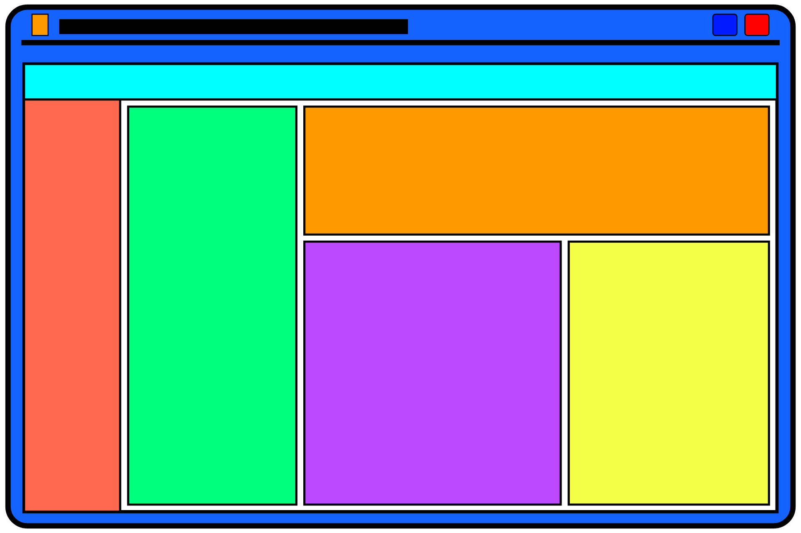

# TopherLee513.github.io

CSS Themes inspired by Desktop UIs like Windows (95/XP/10).

## Written by:

- [Topher Lee](https://TopherLee513.github.io)

## Using:

- **Libraries / Utilities**
  - [node.js]()
  - [sass]()
  - [purify-css]()
  - [express.js]() : WIP
  - [ejs.js]() : WIP

- **IDE / Editors**
  - [ACode](https://play.google.com/store/apps/details?id=com.foxdebug.acode)
  - [Code Editor](https://play.google.com/store/apps/details?id=com.rhmsoft.code)

## Challenges

- Write a Website/Webapp

- From (Almost*) Scratch
  - *Libraries/Google/Etc.

- Make it look good

- Make it do stuff

- Write it all on my phone

## Challenges++

- Rework for express / ejs

- Release As Template

- Create Github Workflow
 - Build and deploy to Firebase

- Merge Blocks-n-Dots project

- Implement Web3

- ???